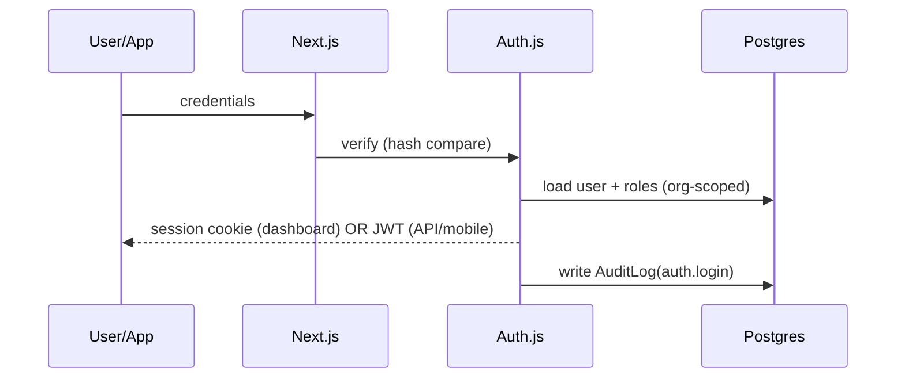

# API Authentication

> **Status:** Needs Implementation — Phase 0 (dashboard auth) / Phase 7 (public API). Intent below from `CLAUDE.md`.

## Mechanisms

- **Dashboard (browser):** Auth.js (NextAuth) credentials provider with **session cookies**. Passwords hashed with argon2 or bcrypt at a sane cost.
- **API / mobile clients:** **JWT** carrying `organizationId` + permission claims (issued Phase 0, consumed by the public API in Phase 7).
- Login **rate-limiting / account lockout** on repeated failures.
- "Forgot password" flow scaffolded in Phase 0 (token model + flow); email delivery via a **no-op adapter** until a provider is chosen (tracked in [Technical Debt](../Engineering/Technical-Debt.md)).
- **All auth events are audit-logged** (`CLAUDE.md` §6).

## Flow (planned)

## Related docs
[Security / Authentication](../Security/Authentication.md) · [Authorization](../Security/Authorization.md) · [Error Handling](./Error-Handling.md)

---
_Last updated: Phase 0 scaffold._
