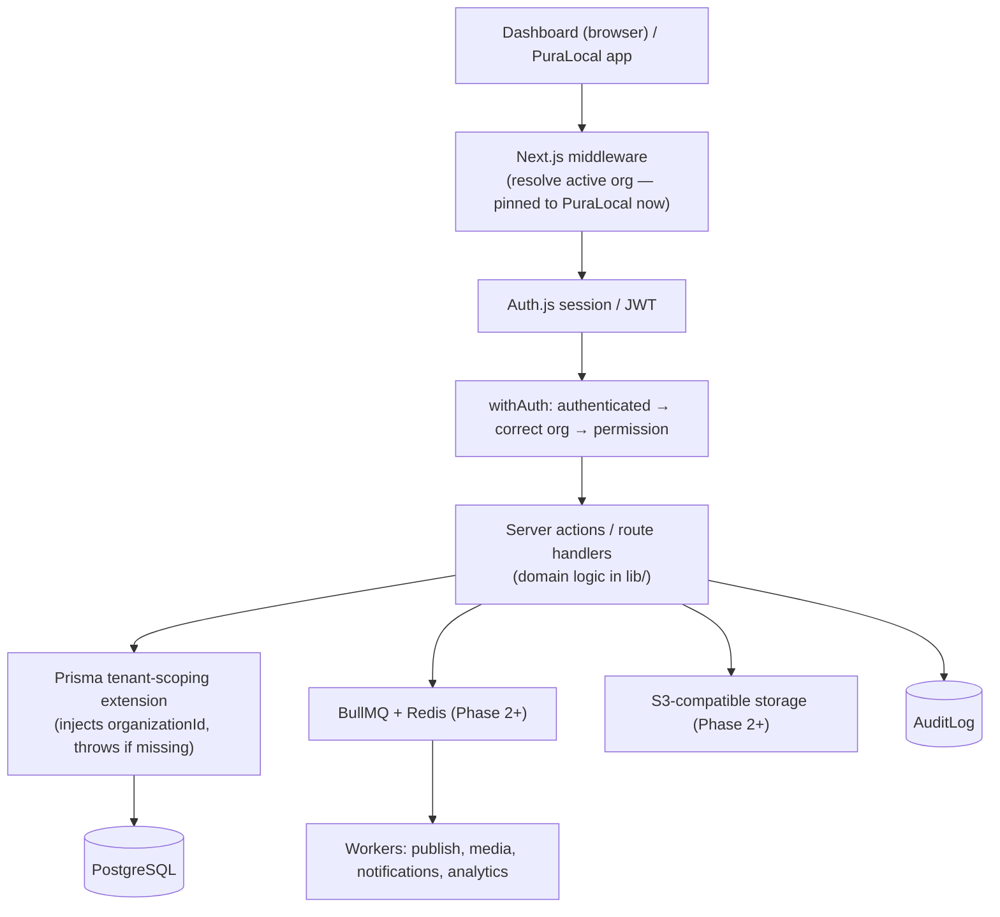

# System Overview

> **Status:** Implemented (intent) — code lands Phase 0 onward. Source of truth: `CLAUDE.md`.

## What this system is

PuraLocal CMS is a **hyperlocal news CMS** — an admin dashboard plus an API — that powers
the PuraLocal news app. It is architected for an eventual multi-tenant, white-label SaaS,
but is being built **PuraLocal-first** as a single tenant (org #1). The visible multi-tenant
surface (org onboarding, branding, custom domains, RLS, org switcher) is deferred to the
final phase, while the data layer is tenant-safe from day one.

## Core capabilities (target)

Content operations across four content types (image post, video post, short, live stream)
sharing one workflow; reporter management and earnings; registered-user and engagement
tracking; monetization (ads, subscriptions); analytics; and a public/mobile API — all
governed by capability-based RBAC and audit logging.

## Technology stack

| Concern | Choice |
|---|---|
| Framework | Next.js (App Router, TypeScript strict) |
| Database | PostgreSQL |
| ORM | Prisma (+ tenant-scoping client extension) |
| Auth | Auth.js (credentials + sessions); JWT for API/mobile |
| Validation | Zod at every boundary |
| UI | Tailwind CSS + shadcn/ui |
| Data/state | React Server Components + server actions; TanStack Query for interactive tables |
| Jobs | BullMQ + Redis (Phase 2+) |
| Storage | S3-compatible object storage behind an interface (Phase 2+) |
| Tests | Vitest (unit), Playwright (e2e) |
| Package manager | pnpm |

## High-level architecture

## Key architectural principles

The defining constraint is **tenant safety in the data layer from day one**: every
tenant-owned table carries an indexed `organizationId`, and a Prisma client extension injects
that filter into every query and throws if org context is missing — even though only PuraLocal
exists today. This makes the eventual white-label conversion additive rather than a rewrite.
Authorization is **capability-based**, not role-name checks. The content domain runs through a
single **state machine** shared by all content types. See [Architecture Decisions](./Architecture-Decisions.md).

## Phase status

See the Status checklist in `CLAUDE.md` and the [Coverage Report](../Coverage-Report.md).

## Related docs

[Data Flow](./Data-Flow.md) · [Component Diagram](./Component-Diagram.md) · [Database Schema](../Data/Database-Schema.md) · [Authorization](../Security/Authorization.md)

---
_Last updated: Phase 0 scaffold._
