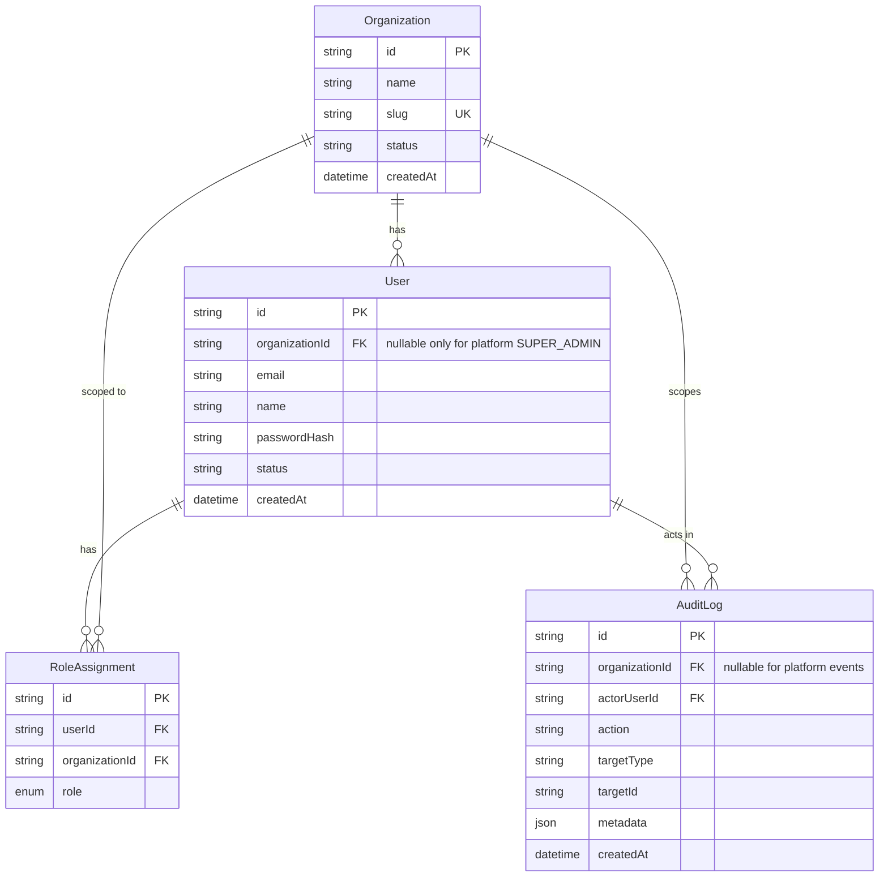

# Database Schema

> **Status:** Partially Implemented — Phase 0 (planned model below; confirm against `prisma/schema.prisma` once written).

## Conventions

- PostgreSQL via Prisma. Schema lives in `prisma/schema.prisma`.
- **Every tenant-owned table has a non-null, indexed `organizationId`.** (`CLAUDE.md` §3)
- Migrations: one per schema change, committed together; never edit a shipped migration. See [Migrations](./Migrations.md).
- The Prisma tenant-scoping extension injects `organizationId` on every tenant-owned query — see [Authorization](../Security/Authorization.md).

## Phase 0 model (planned)

> Confirm field names/types against the actual `prisma/schema.prisma` after Phase 0 and flip this to **Implemented**.

Notes:
- `User.email` is unique **per org** (composite uniqueness), not globally.
- `AuditLog` indexed by `(organizationId, createdAt)`.
- Auth.js session/account tables exist as required by the adapter.

## Models added in later phases (planned — stubs)

| Phase | Models (intended) |
|---|---|
| 1 | `Content` (type discriminator, status, language/category/location/reporter FKs, scheduledAt, publishedAt), `Category`, `Location`, `Language` |
| 2 | Media/asset records, job-tracking rows if needed |
| 3 | `Reporter`, verification docs, assignments, `EarningsLedger` |
| 4 | `AppUser`, `EngagementEvent` (+ rollup tables) |
| 5 | `AdUnit`, `AdCampaign`, `SubscriptionPlan`, `Subscriber` |
| 6 | Analytics read models / materialized views |
| 8 | (No new core columns — `organizationId` already present; RLS policies + per-tenant config tables) |

## Risks / notes
- The single largest schema risk is any tenant-owned table shipping **without** `organizationId`. The cross-org denial test (every resource) is the guard against this.

## Related docs
[Entities](./Entities.md) · [Relationships](./Relationships.md) · [Migrations](./Migrations.md) · [Authorization](../Security/Authorization.md)

---
_Last updated: Phase 0 scaffold (planned model — verify against code)._
