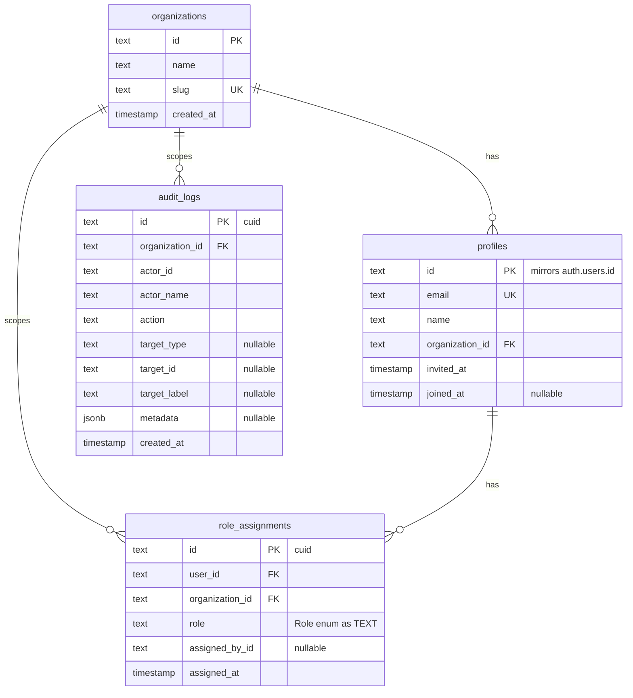

# Database Schema

> **Status:** Implemented — Supabase swap slice.

## Conventions

- PostgreSQL via Supabase. Schema lives in [prisma/schema.prisma](../../prisma/schema.prisma).
- **Every tenant-owned table has a non-null, indexed `organization_id`.** (`CLAUDE.md` §3)
- Migrations: one per schema change, committed together; never edit a shipped migration. See [Migrations](./Migrations.md).
- The `withOrgContext` helper in `lib/supabase/supabase-repositories.ts` injects `SET LOCAL ROLE prisma_app` + `set_config('app.organization_id', ...)` on every repository query — see [Authorization](../Security/Authorization.md).

## Phase 0 schema

Four tables. All tenant-owned tables carry a non-null `organization_id` (CLAUDE.md §3 invariant).

### Key design decisions

- `profiles.id` is TEXT (not a serial integer) — it mirrors `auth.users.id` (UUID) from Supabase Auth.
- `role_assignments` has `@@unique([userId, organizationId])` — one active role per user per org; `upsert` replaces on reassign.
- `role` is TEXT not a Prisma enum so role values can be added without a DB migration.
- `audit_logs.metadata` is JSONB — flexible per-action payload.

### Indexes

| Table | Index | Type |
|---|---|---|
| `organizations` | `slug` | UNIQUE |
| `profiles` | `email` | UNIQUE |
| `profiles` | `organization_id` | Regular |
| `role_assignments` | `(user_id, organization_id)` | UNIQUE |
| `role_assignments` | `organization_id` | Regular |
| `audit_logs` | `organization_id` | Regular |

## Models added in later phases (stubs)

| Phase | Models |
|---|---|
| 1 | `Content`, `Category`, `Location`, `Language` |
| 2 | Media/asset records |
| 3 | `Reporter`, `EarningsLedger` |
| 4 | `AppUser`, `EngagementEvent` |
| 5 | `AdUnit`, `AdCampaign`, `SubscriptionPlan` |
| 8 | (No new core columns — `organization_id` already present; per-tenant config tables) |

## Related docs
[Migrations](./Migrations.md) · [Authorization](../Security/Authorization.md)

---
_Last updated: Supabase swap slice complete (2026-06-26)._
