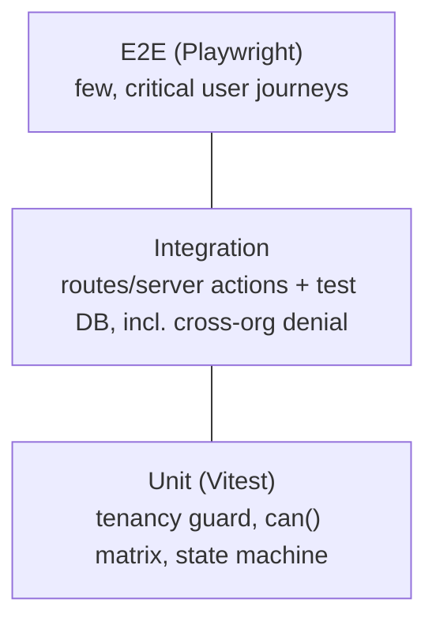

# Testing Strategy

> **Status:** Implemented (convention) — applies from Phase 0. Source: `CLAUDE.md`.

## Tooling
- **Vitest** — unit tests for `lib/` domain logic.
- **Playwright** — end-to-end happy paths against a running app + test DB.

## What "done" requires (every feature)
1. Unit tests for the feature's `lib/` logic.
2. At least one e2e happy path.
3. **A cross-org denial test for every new resource** — even with one org. This proves the Prisma tenant guard works and is the single most important test class in the project.

## Test pyramid (intended)

## Phase 0 baseline tests
- Tenancy guard: injects `organizationId`; **throws** when org context is missing; returns nothing for a foreign org.
- `can()` permission matrix across roles.
- Auth flow states (login success/failure, lockout).
- E2E: login → invite user → assign role → see audit entry → permission-gated nav.

## Conventions
- Use a disposable test database; seed deterministically.
- External services are faked via their adapter interfaces (no live calls in tests).

## Related docs
[Unit Tests](./Unit-Tests.md) · [Integration Tests](./Integration-Tests.md) · [E2E Tests](./E2E-Tests.md) · [Coding Standards](../Engineering/Coding-Standards.md)

---
_Last updated: Phase 0 scaffold._
